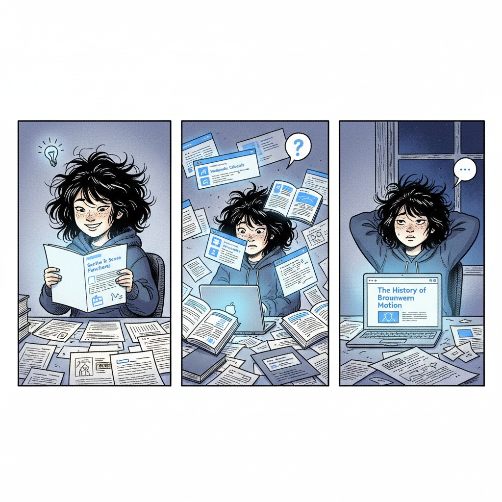
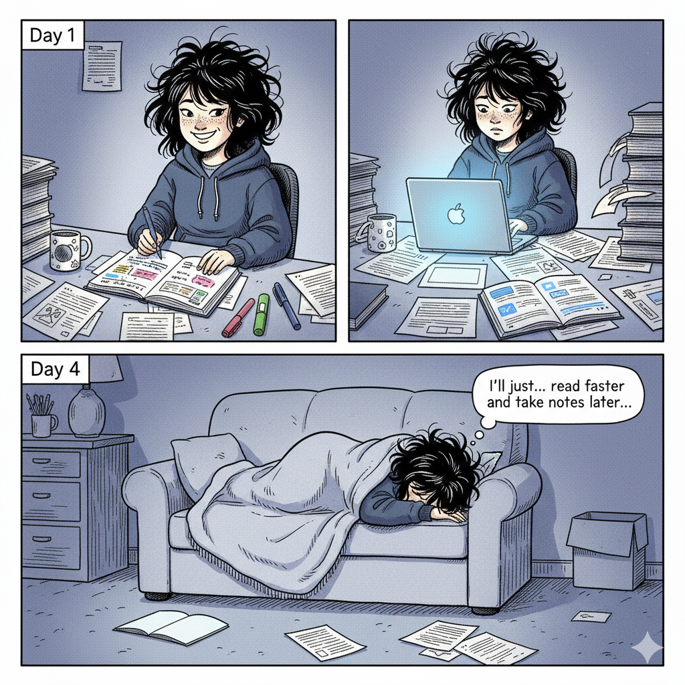
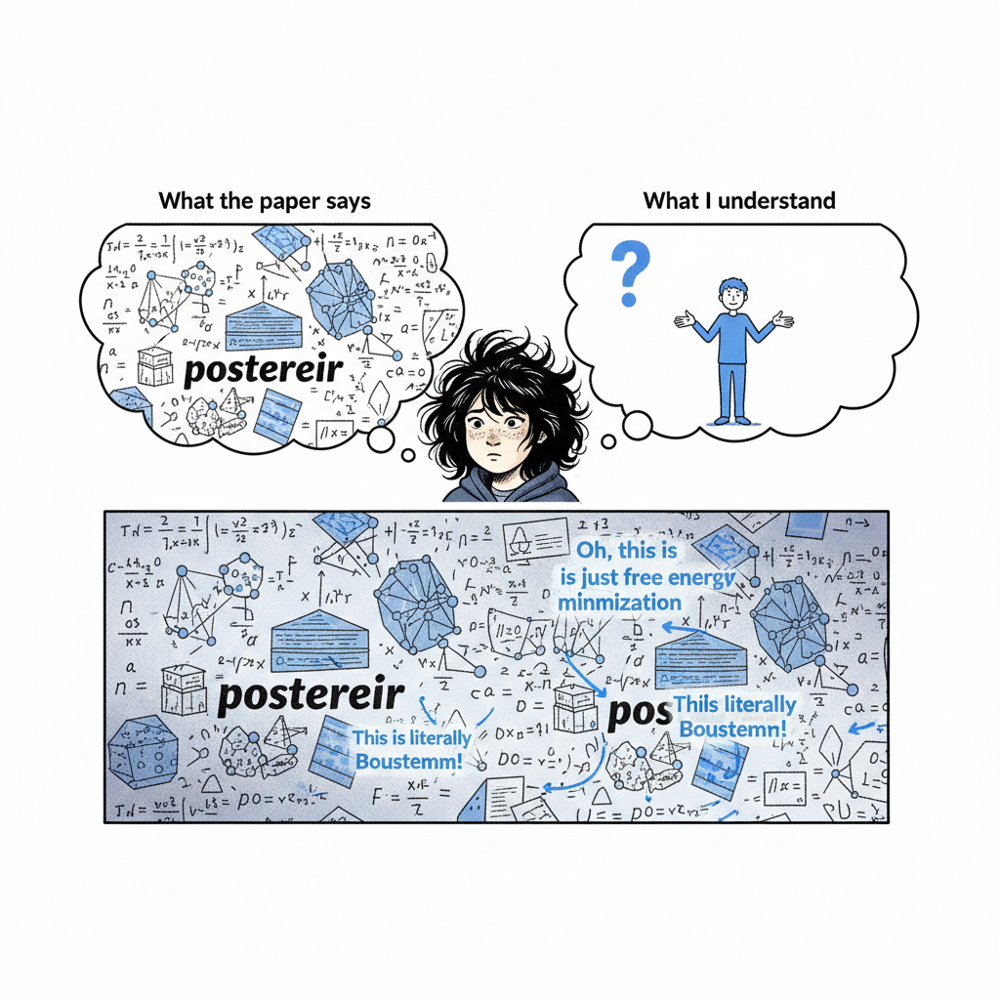
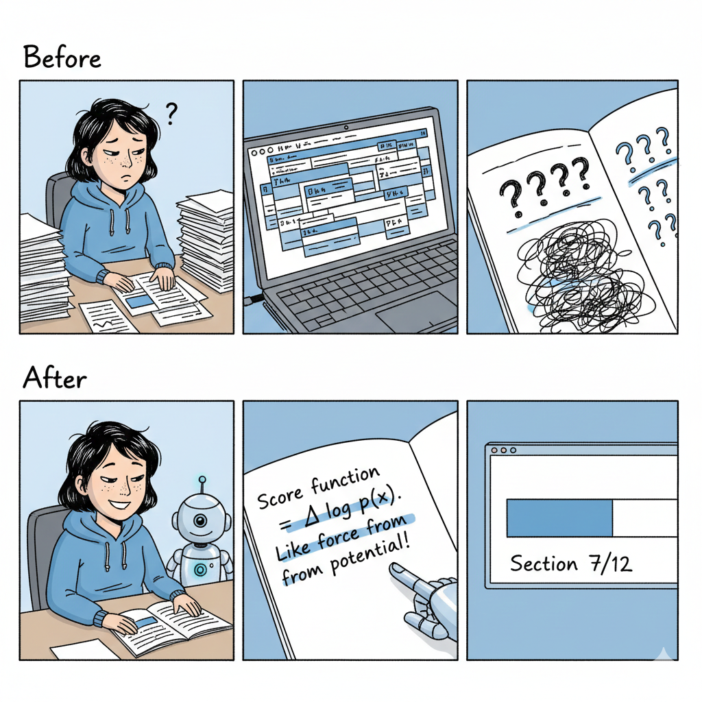
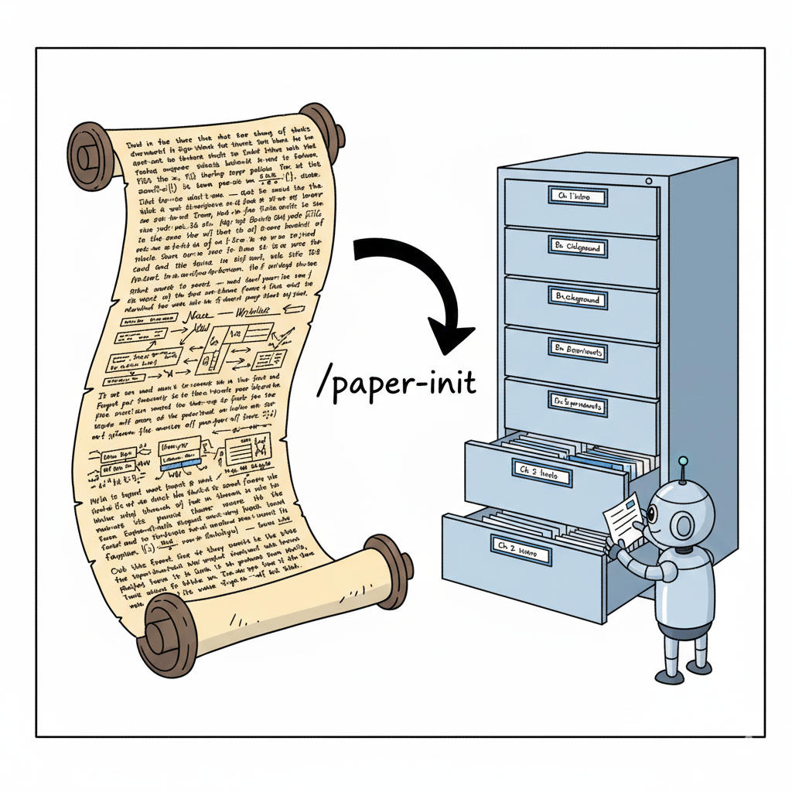
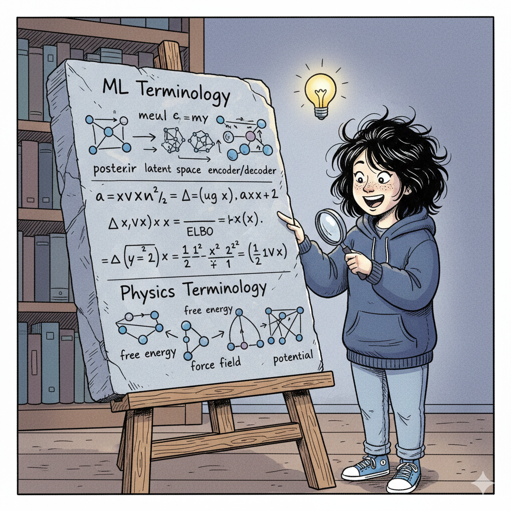
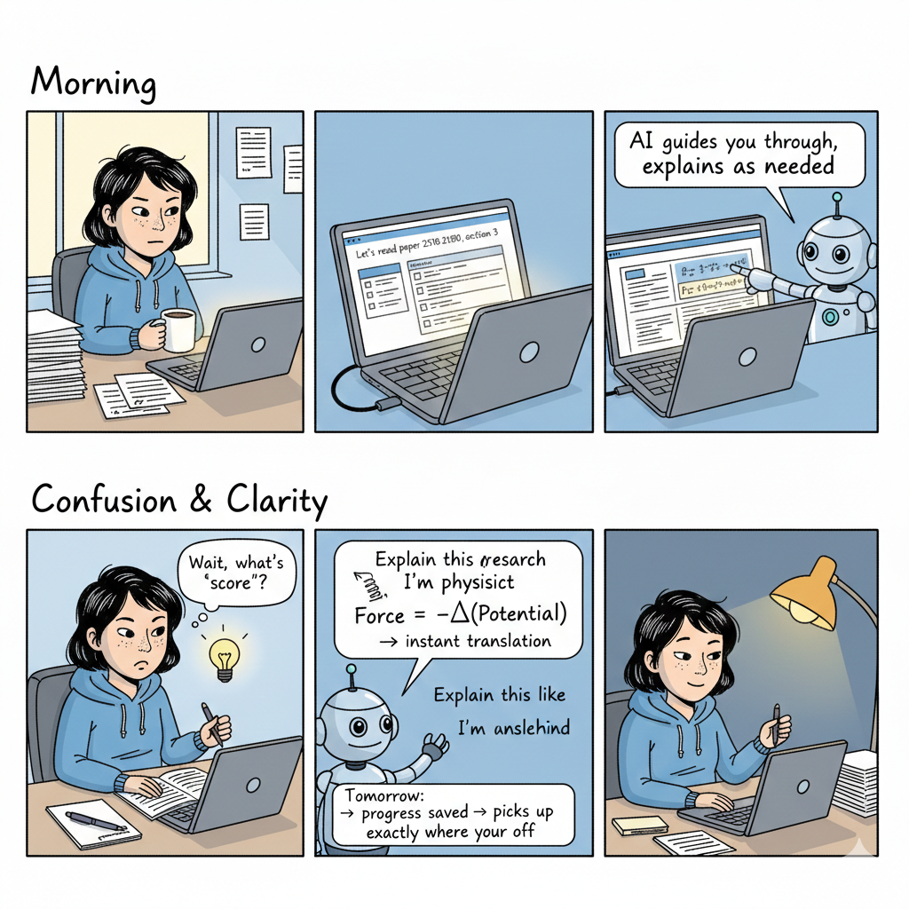
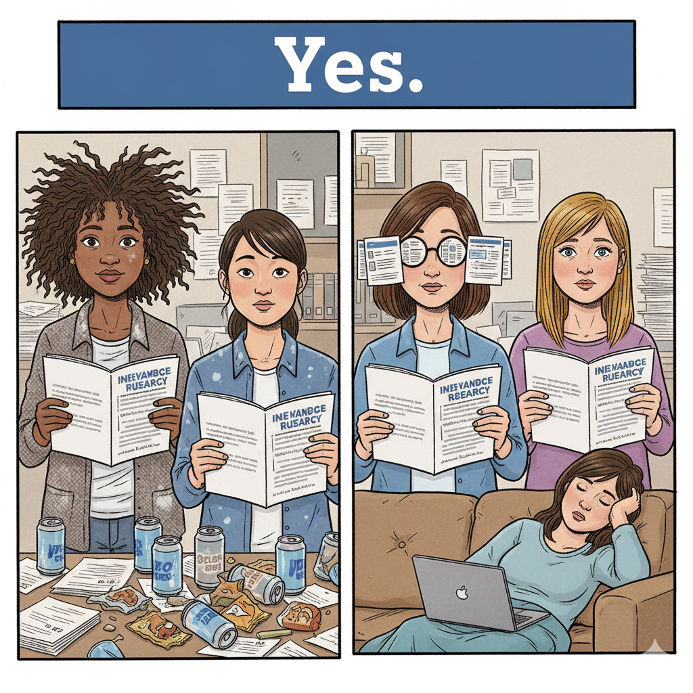
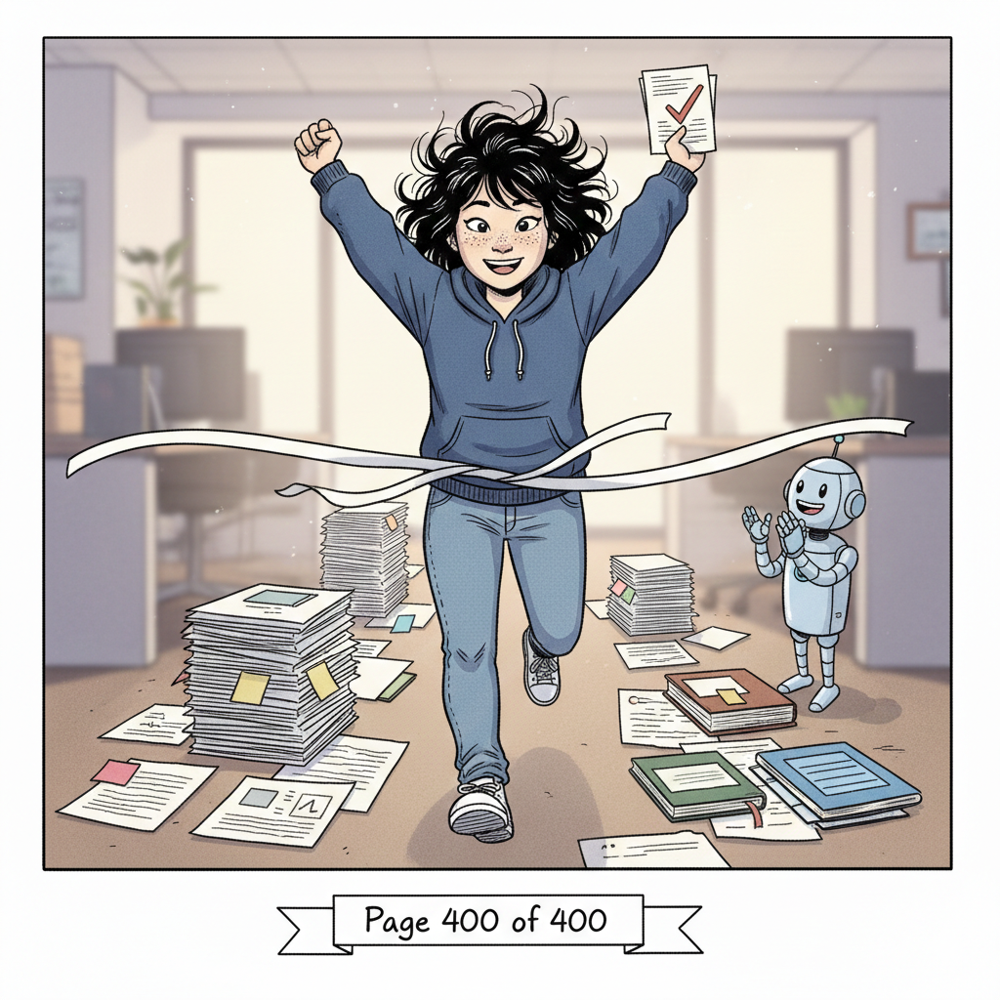

# The ArXiv Reading Assistant

*A tool for those of us who start papers but rarely finish them.*

---


<!-- 
ILLUSTRATION PROMPT #1 - Hero Image:
A comic panel showing a researcher at a messy desk, surrounded by half-read papers.
Some papers are highlighted in the middle, some have coffee stains, some are folded 
as bookmarks. The researcher looks overwhelmed but hopeful, staring at a glowing 
laptop screen. Evening light through a window. 

Style: New Yorker cartoon aesthetic, single color ink with one accent color (blue),
hand-drawn linework, slightly satirical but warm. Wide 16:9 aspect ratio.
-->

---

## The Problem with Long Papers

There is a particular kind of guilt that comes with downloading a 400-page review paper. You do it with the best intentions. You think: *This weekend, I will finally understand diffusion models.* You pour coffee. You sit down. You read the abstract, the introduction, perhaps the first section. And then—



<!--
ILLUSTRATION PROMPT #2 - The Rabbit Hole:
A three-panel comic strip:
Panel 1: A reader confidently opening a paper titled "Section 3: Score Functions"
Panel 2: The same reader now surrounded by 15 browser tabs, Wikipedia pages, 
         a YouTube video, and three other papers
Panel 3: It's now dark outside. The reader is reading about "The History of 
         Brownian Motion" and has completely forgotten the original paper.

Style: New Yorker cartoon, black ink with minimal shading, 
dry humor, each panel same size, horizontal strip format.
-->

You find yourself, three hours later, reading about the history of Brownian motion on Wikipedia. The original paper sits minimized, its progress bar forever stuck at page 47.

I am a physicist by training. I have spent years reading dense papers about quantum mechanics, statistical thermodynamics, and computational materials science. I thought I knew how to read. But machine learning papers broke me.

---

## The Note-Taking Paradox

The advice is always the same: *Take notes. Summarize each section. Write in your own words.* 

This is good advice. It is also exhausting advice.



<!--
ILLUSTRATION PROMPT #3 - The Note-Taking Paradox:
A two-panel comic:
Panel 1: "Day 1" - A pristine notebook with beautiful, color-coded notes on 
         "Chapter 1: Introduction to VAEs". The reader looks pleased.
Panel 2: "Day 4" - The notebook is abandoned. The reader is lying face-down 
         on a couch. The paper is now on page 89 of 400. A thought bubble says 
         "I'll just... read faster and take notes later..."

Style: New Yorker cartoon, ink drawing, relatable academic humor,
the contrast between aspiration and reality.
-->

By section three, the notes become sparse. By section seven, they are just question marks. By section twelve, you have stopped pretending.

The problem is not laziness. The problem is that note-taking while reading is *two tasks*, and human working memory is not infinite. Every time you stop to write, you lose the thread. Every time you push forward, you lose the details.

---

## The Translation Problem

Here is a sentence from a machine learning paper:

> "We minimize the KL divergence between the variational posterior and the true posterior by maximizing the evidence lower bound."

Here is what I, a physicist, initially read:

> "We minimize [something about entropy?] between [a thing] and [another thing] by maximizing [a lower bound on something]."



<!--
ILLUSTRATION PROMPT #4 - Lost in Translation:
A comic showing two thought bubbles from the same reader:

Left bubble (labeled "What the paper says"): 
Dense equations, Greek letters, neural network diagrams, the word "posterior" 
appearing suspiciously often.

Right bubble (labeled "What I understand"):
A question mark. Maybe a stick figure shrugging.

Below, a third panel: The same content, but now with annotations like 
"Oh, this is just free energy minimization" and "This is literally Boltzmann!"
The reader looks relieved.

Style: New Yorker cartoon, two-tone, the "aha moment" should feel earned.
-->

It took me an embarrassingly long time to realize that "variational inference" is, essentially, free energy minimization with a different hat. That "score functions" are just gradients of log-probability—something any physicist uses daily without giving it a name.

The concepts were not hard. The *translation* was hard.

---

## What I Actually Needed

After abandoning my fifteenth paper somewhere around page 60, I made a list:

1. **I needed focus.** Someone—or something—to keep me on track. To say: *You are in Section 4. Finish Section 4. The rabbit hole will still be there tomorrow.*

2. **I needed translation.** Not dumbed-down explanations, but *mappings*. Tell me that "attention" is just a weighted kernel. Tell me that "dropout" is ensemble averaging. Give me a foothold.

3. **I needed compression.** At the end of a reading session, I needed the key insights saved somewhere. Not my own exhausted notes, but the *actual* important points, extracted and filed.

4. **I needed a fresh start.** Every day, a clean slate. No guilt about yesterday's abandoned session. Just: *Where were we? Ah, Section 7. Let's continue.*



<!--
ILLUSTRATION PROMPT #5 - The Solution:
A comic showing the "before and after":

Top row (labeled "Before"): 
- Chaotic desk, multiple open papers, confused expression
- Browser with 30 tabs
- Notes that say "????"

Bottom row (labeled "After"):
- Clean desk, one paper open to a specific section
- A friendly robot assistant pointing at the relevant paragraph  
- Notes that say "Score function = ∇ log p(x). Like force from potential!"
- A progress bar showing "Section 7/12"

Style: New Yorker cartoon, satisfying contrast, the robot should look 
helpful not creepy, like a good librarian.
-->

---

## Enter the Reading Assistant

This repository is my solution. It is not complicated. It is a set of Python scripts and a workflow designed for one purpose: **to help you actually finish reading papers.**

Here is what it does:

### 1. Paper Initialization

You give it an arXiv ID. It downloads the LaTeX source, splits it into sections, and builds an index. Now you have a map.



<!--
ILLUSTRATION PROMPT #6 - Paper Initialization:
A comic panel showing a transformation:

Left side: A massive, intimidating scroll/document with tiny text, 
looking like an ancient overwhelming tome.

Right side: The same content, but now neatly organized into a filing cabinet 
with labeled drawers: "Ch 1: Intro", "Ch 2: Background", "Ch 3: Methods", etc.
A small robot is organizing the last drawer.

An arrow labeled "/paper-init" connects the two sides.

Style: New Yorker cartoon, the contrast between chaos and order,
the robot should look industrious and cheerful.
-->

### 2. Focused Reading Sessions

The AI assistant keeps you on track. It reads with you, section by section. When you wander, it gently redirects. When you're confused, it translates.

*"Think of the score function as the force derived from a potential energy surface. You know how in physics, F = -∇U? Here, the score is ∇ log p(x). Same idea, different sign convention."*

### 3. Physics-Friendly Translation

Every ML concept, mapped to something a physicist already knows:

| ML Concept | Physics Analogy |
|------------|-----------------|
| Loss landscape | Potential energy surface |
| Gradient descent | Steepest descent / relaxation |
| Attention mechanism | Weighted averaging / kernel |
| Regularization | Lagrange multipliers / constraints |
| Batch normalization | Rescaling / renormalization |
| Dropout | Stochastic sampling / ensemble |
| Transformer | Message-passing on fully-connected graph |



<!--
ILLUSTRATION PROMPT #7 - The Rosetta Stone:
A comic showing a stone tablet (like the Rosetta Stone) with three rows:

Top row: ML terminology with neural network symbols
Middle row: Mathematical notation (the bridge)  
Bottom row: Physics terminology with familiar diagrams (springs, particles, fields)

A researcher is studying it with an "aha!" expression.

Style: New Yorker cartoon, the tablet should look ancient but the content modern,
humorous juxtaposition of old and new.
-->

### 4. Session Management

Each day is a fresh start. The assistant remembers where you left off, summarizes what you covered, and saves your insights. No guilt. No backlog. Just progress.

---

## The Workflow



<!--
ILLUSTRATION PROMPT #8 - Daily Workflow:
A four-panel comic showing a typical reading day:

Panel 1 (Morning): "Let's read 2510.21890" - Coffee in hand, paper index on screen
Panel 2 (Reading): Focused reading, robot assistant highlighting key equation
Panel 3 (Confusion): "Wait, what's a 'score'?" - Robot responds with physics analogy
Panel 4 (Evening): "Save and end session" - Progress saved, notes filed, 
                   researcher looks satisfied (not exhausted)

Style: New Yorker cartoon, warm, the progression should feel achievable,
not heroic—just steady, sustainable work.
-->

```
Morning:    "Let's read paper 2510.21890, section 3"
Reading:    AI guides you through, explains as needed
Confusion:  "Explain this like I'm a physicist" → instant translation  
Evening:    "End session" → progress saved, key insights noted
Tomorrow:   "Continue" → picks up exactly where you left off
```

---

## Who This Is For

This tool is for:

- **Physicists** learning machine learning (my people)
- **Anyone** who starts more papers than they finish
- **Readers** who get lost in rabbit holes
- **Students** overwhelmed by 100+ page reviews
- **Researchers** who want to read, not just skim



<!--
ILLUSTRATION PROMPT #9 - The Target Audience:
A group portrait comic showing different types of readers, all looking slightly 
overwhelmed but hopeful:

- A physicist with wild hair and a chalk-stained shirt
- A grad student surrounded by energy drink cans
- A researcher with 15 browser tabs visible in glasses reflection
- A person on a couch with a laptop, half-asleep

They're all holding the same thick paper and looking at the viewer as if to say 
"Is this tool for me?" A banner above says "Yes."

Style: New Yorker cartoon, group portrait, diverse but united by shared struggle,
warm and inclusive humor.
-->

---

## Getting Started

```bash
# Clone the repository
git clone https://github.com/nw13slx/arxiv-reading-assistant.git
cd arxiv-reading-assistant

# Initialize a paper
python -m skills.paper_init 2510.21890

# Start reading
# (Use with GitHub Copilot CLI or similar AI assistant)
```

The rest is conversation.

---

## Technical Details

For those who want them (everyone else can skip to [Contributing](#contributing)):

<details>
<summary>Repository Structure</summary>

```
arxiv-reading-assistant/    # Tools (public)
├── scripts/                # Python processing scripts
├── skills/                 # Copilot skill definitions  
├── tests/                  # 45 unit tests
└── docs/                   # Documentation & illustrations

arxiv-reading-data/         # Data (private, separate repo)
├── papers/                 # Downloaded & processed papers
├── notes/                  # Your reading notes
└── sessions/               # Session logs
```
</details>

<details>
<summary>Available Skills</summary>

- `/paper-init <arxiv_id>` — Initialize a paper for reading
- `/privacy-scan` — Scan for sensitive info before publishing
- `/stage-commit` — Privacy scan + update docs + commit
</details>

<details>
<summary>Privacy Protection</summary>

The tool includes a privacy scanner that checks for:
- Home directory paths
- Usernames and email addresses
- API keys and secrets
- Corporate identifiers

Run `python scripts/privacy_scan.py .` before pushing.
</details>

---

## Contributing

Found a bug? Have a translation to add? Want to improve the prompts?

Pull requests are welcome. So are issues describing papers that broke you.

---

## Acknowledgments

This tool exists because I could not finish reading [Yang et al., "Diffusion Models: A Comprehensive Survey of Methods and Applications"](https://arxiv.org/abs/2510.21890). 

It is 400 pages long. It has 3,580 equations. I have read perhaps 200 pages across six separate attempts over two years.

With this tool, I finished it in two weeks.



<!--
ILLUSTRATION PROMPT #10 - The Finish Line:
A triumphant comic panel:

A reader crossing a finish line, arms raised in victory. Behind them, 
a trail of organized notes and highlighted sections. The paper (now looking 
friendly, not intimidating) is tucked under their arm with a checkmark on it.

A small robot assistant is applauding from the sidelines.

Caption: "Page 400 of 400"

Style: New Yorker cartoon, celebratory but understated, 
the victory is quiet and personal, not grandiose.
-->

---

*Now go finish that paper you've been avoiding.*

---

<sub>Built with frustration, coffee, and eventually—hope.</sub>
